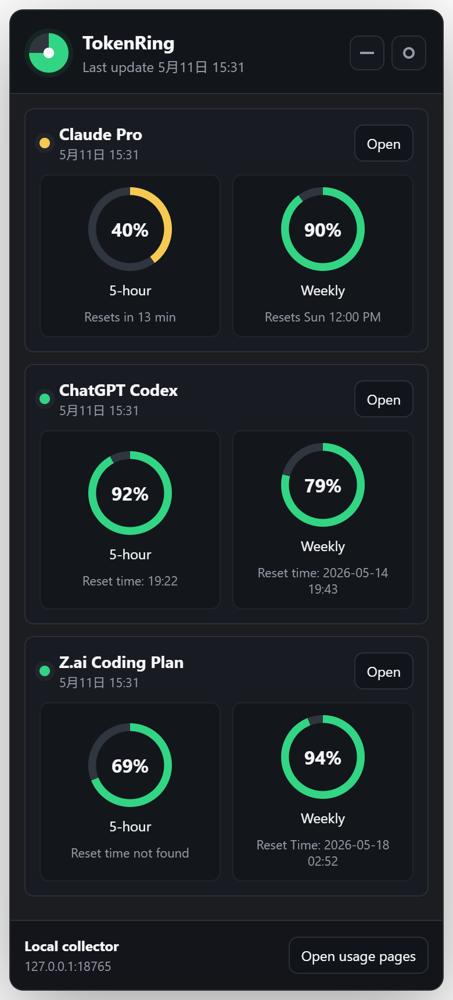

# TokenRing

TokenRing is a local Windows-friendly quota viewer for subscription usage pages that do not expose stable public APIs.
It can collect usage from embedded Electron browser pages, so Chrome or Edge does not need to stay open after you have logged in inside TokenRing.

The MVP supports:

- Claude Pro usage page: `https://claude.ai/settings/usage`
- ChatGPT Codex usage page: `https://chatgpt.com/codex/cloud/settings/analytics#usage`
- Z.ai subscription page: `https://z.ai/manage-apikey/subscription`



## How It Works

TokenRing has two collection paths:

1. Embedded collectors inside the Electron tray app. TokenRing opens hidden browser pages for Claude, ChatGPT Codex, and Z.ai, then reads visible usage values from those pages.
2. Optional Chrome/Edge extension collection. The extension can still read already-open usage pages and post the latest snapshot to the local app.

The app does not store passwords. Embedded collectors keep login sessions in Electron's local browser session. The extension does not store passwords, cookies, or account tokens.

## Run the Desktop App

```powershell
npm install
npm start
```

The app starts hidden in the Windows tray. Click the TokenRing tray icon or use its tray menu to show the window. Closing or minimizing the window hides it back to the tray.

For embedded collection, click each provider's `Open` button in TokenRing and log in inside the embedded window. After login, TokenRing can keep collecting in the background while Chrome or Edge is closed.

## Install the Browser Extension

The browser extension is optional when embedded collection is working. It is still useful as a fallback collector for pages already open in Chrome or Edge.

Chrome or Edge:

1. Open `chrome://extensions` or `edge://extensions`.
2. Enable Developer mode.
3. Click Load unpacked.
4. Select `D:\my_software\TokenRing\extension`.

Then open each usage page while the desktop app is running:

- Claude: `https://claude.ai/settings/usage`
- ChatGPT Codex: `https://chatgpt.com/codex/cloud/settings/analytics#usage`
- Z.ai: `https://z.ai/manage-apikey/subscription`

The rings update when the extension detects visible percentages on the page.

The extension also refreshes any already-open usage tabs about once per minute. You can force a refresh from the extension popup with **Refresh open tabs now**.

## Embedded Collection

The embedded collectors refresh about once per minute while TokenRing is running. Use the tray menu item **Refresh Embedded Collectors** to force an immediate refresh.

First-time setup:

1. Start TokenRing.
2. Click the tray icon to show the window.
3. Click `Open` for Claude, ChatGPT Codex, and Z.ai.
4. Log in inside each embedded window if prompted.
5. Leave TokenRing running in the tray.

The embedded windows can be closed after login; TokenRing hides them and continues collecting in the background.

## Color Rules

- More than 40% remaining: green
- More than 15% remaining: yellow
- 15% or less remaining: red

## Current Limitations

This MVP reads visible percentages heuristically. If a provider changes its page text or DOM structure, update `extension/content.js` for that provider.

If TokenRing shows that a page was seen but no metrics were found, the extension is installed and connected, but the extractor did not match that page's current text or DOM.

If a page remains `Never updated`, open the extension popup and click **Refresh open tabs now**. The popup reports whether it used the normal content script or the forced injection fallback for each open usage tab.

Codex and Claude usually display remaining/used values differently, so TokenRing normalizes them:

- ChatGPT Codex defaults to treating percentages as remaining.
- Claude and Z.ai default to treating percentages as used.

## 中文说明

TokenRing 是一个面向 Windows 的本地额度查看工具，用于快速查看 Claude Pro、ChatGPT Codex 和 Z.ai Coding Plan 的订阅制额度。它不调用这些平台的私有接口，也不保存账号密码。当前分支加入了内置浏览器采集器：你可以在 TokenRing 自己打开的登录窗口中登录三个平台，之后即使关闭 Chrome/Edge，只要 TokenRing 还在托盘运行，它也可以继续定时读取官方 usage 页面上的可见额度。


### 工作方式

TokenRing 有两条采集路径：

1. 内置浏览器采集器：TokenRing 使用 Electron 后台浏览器窗口打开 Claude、ChatGPT Codex 和 Z.ai 的 usage 页面，并读取页面上可见的额度。
2. Chrome/Edge 扩展：可选备用方案，在你已经打开的浏览器 usage 页面中读取额度，并发送到本机桌面端。

支持的页面：

- Claude Pro：`https://claude.ai/settings/usage`
- ChatGPT Codex：`https://chatgpt.com/codex/cloud/settings/analytics#usage`
- Z.ai：`https://z.ai/manage-apikey/subscription`

### 安装桌面端

开发环境运行：

```powershell
npm install
npm start
```

打包后运行：

1. 解压 `release/app/TokenRing-0.1.0-win-x64.zip`。
2. 运行解压目录中的 `TokenRing.exe`。
3. 程序启动后默认隐藏在 Windows 右下角托盘中。
4. 点击托盘图标，或在托盘右键菜单中选择 `Show TokenRing` 显示窗口。
5. 点击每个平台的 `Open`，在 TokenRing 内置窗口中完成登录。

如果右下角没有直接看到图标，请先检查 Windows 托盘的 `^` 隐藏图标区域。

### 安装浏览器扩展

内置采集器可用时，浏览器扩展不是必须的。扩展适合作为备用采集方式，或者用于读取你已经在 Chrome/Edge 中打开的 usage 页面。

1. 解压 `release/extension/TokenRing-Collector-0.1.2.zip` 到一个固定目录。
2. 打开 `chrome://extensions` 或 `edge://extensions`。
3. 开启开发者模式。
4. 点击“加载已解压的扩展”。
5. 选择刚才解压出来的扩展目录。
6. 保持 TokenRing 桌面端运行。
7. 打开 Claude、ChatGPT Codex、Z.ai 的 usage 页面。
8. 点击扩展图标中的 `Refresh open tabs now`，手动刷新一次已打开页面。

扩展也会定时刷新已经打开的 usage 页面，因此页面保持打开时，额度会自动更新。

### 内置采集器

内置采集器会在 TokenRing 运行时大约每 1 分钟刷新一次。你也可以在托盘菜单中点击 `Refresh Embedded Collectors` 立即刷新。

首次使用建议：

1. 启动 TokenRing。
2. 点击托盘图标显示主窗口。
3. 分别点击 Claude、ChatGPT Codex、Z.ai 的 `Open` 按钮。
4. 在弹出的 TokenRing 内置浏览器窗口中登录对应平台。
5. 登录成功后可以关闭这些内置窗口；关闭操作只是隐藏窗口，后台仍会继续采集。
6. 后续可以关闭 Chrome/Edge，只保留 TokenRing 托盘进程运行。

### 显示规则

界面只显示两类核心额度：

- `5-hour`
- `Weekly`

其他项目，例如 monthly spend、Codex Spark 额度或额外工具额度，会被隐藏。

颜色含义：

- 剩余量大于 40%：绿色
- 剩余量大于 15% 且小于等于 40%：黄色
- 剩余量小于等于 15%：红色

### 常见问题

如果某个平台显示 `Never updated`，通常说明扩展还没有在对应页面成功采集。请确认：

- 桌面端正在运行。
- 浏览器扩展已经加载并启用。
- 你已经登录对应平台。
- usage 页面已经完整加载。
- 已在扩展弹窗中点击 `Refresh open tabs now`。

如果 Z.ai 或其他平台某一项数据偶尔短暂没有读到，桌面端会保留上一轮同类指标，不会用半包刷新清空已有的 weekly 数据。

### 打包

生成桌面端和扩展包：

```powershell
npm run dist
```

单独生成 README 截图：

```powershell
npm run screenshot
```
